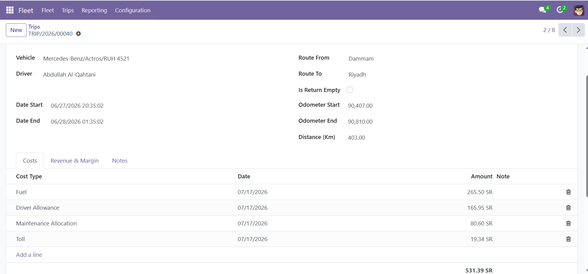
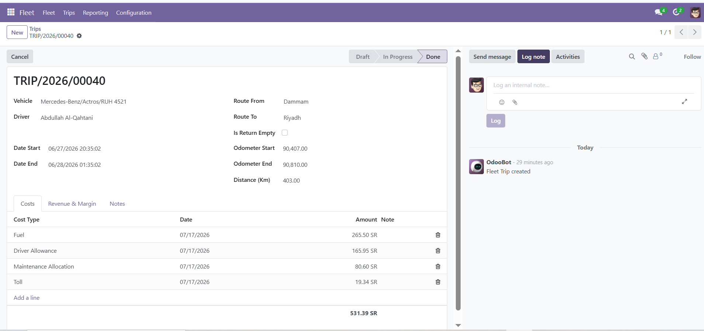
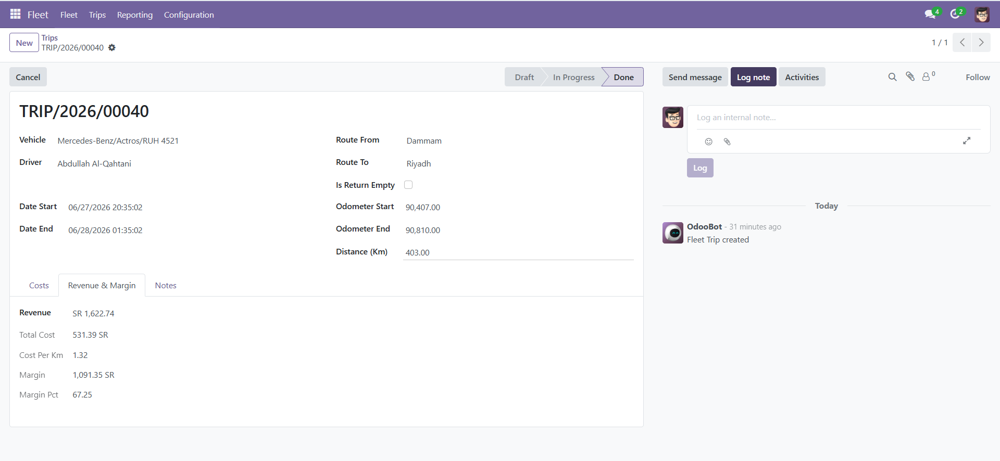
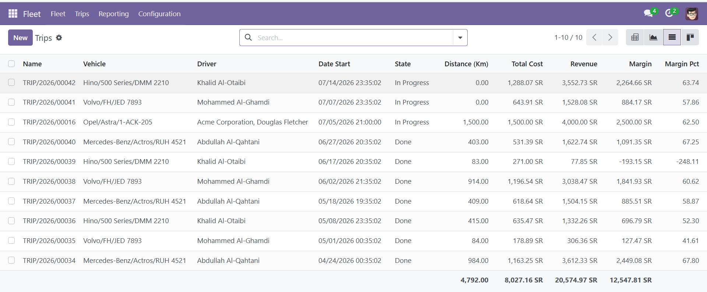
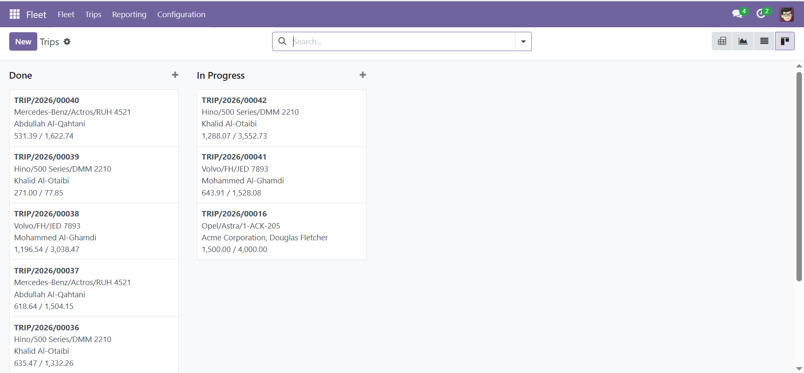
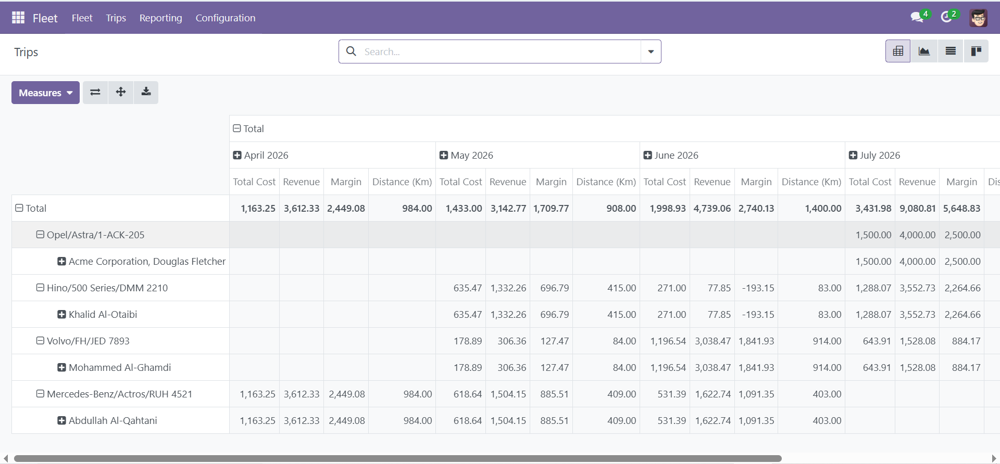
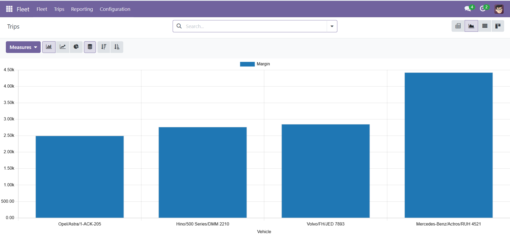
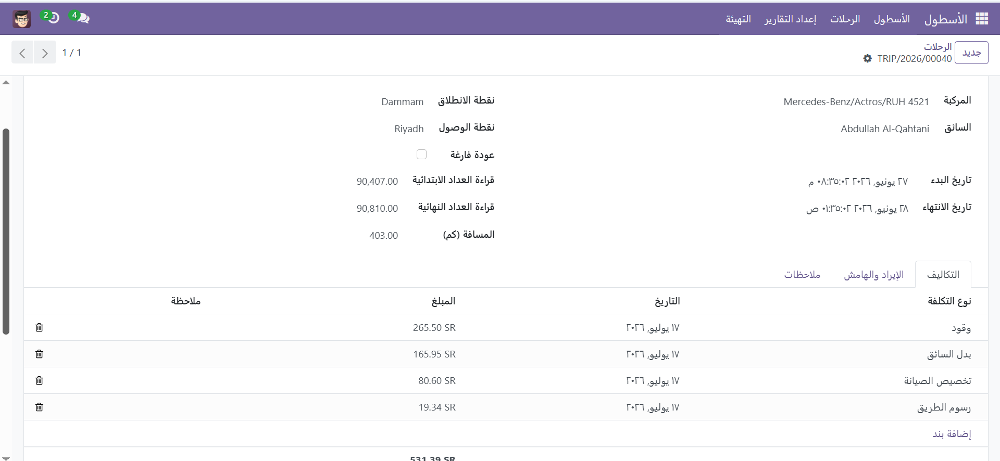
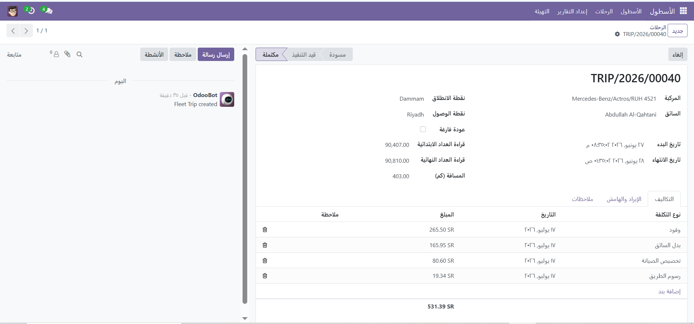

# Fleet Trip Costing & Profitability

Per-trip cost capture, cost/km, and margin analytics on Fleet.

[](https://github.com/Zahoor-ishfaq/odoo-fleet-trip-costing/actions/workflows/ci.yml)
[](./LICENSE)

## Why this module

Odoo's built-in Fleet module tracks vehicles, drivers, contracts, and
services well, but it has no concept of a trip as a costed,
revenue-generating unit of work. There is no built-in way to answer
"did this trip make money?" without exporting data into a spreadsheet.
Fleet Trip Costing adds a trip record on top of Fleet: capture what a
trip cost (fuel, tolls, driver allowance, maintenance allocation),
what it earned, and get cost/km and margin computed automatically,
with pivot and graph views for fleet-wide profitability analysis.

## Features

- Trip records linked to a vehicle, driver, and route (from/to, dates,
  odometer readings)
- Cost lines per trip against a configurable list of cost types (fuel,
  tolls, driver allowance, maintenance allocation, depreciation, misc)
- Auto-computed, stored: distance (km), total cost, cost per km,
  margin, margin %
- Trip state workflow: draft, in progress, done, with cancel and reset
- Pivot and graph analytics: cost, revenue, and margin by vehicle,
  driver, and month
- Multi-company aware: trips are scoped to the user's company via a
  record rule

## Installation

**Option 1: clone into your addons path**

```bash
git clone https://github.com/Zahoor-ishfaq/odoo-fleet-trip-costing.git
```

Point your Odoo `addons_path` at the cloned repository's root
directory (or copy `fleet_trip_costing/` into an existing custom
addons directory), then, as an administrator: Apps -> Update Apps
List -> search "Fleet Trip Costing" -> Install.

**Option 2: Odoo Apps Store**

Once published, install directly from apps.odoo.com, or from Apps ->
search "Fleet Trip Costing" inside Odoo. No manual file copying
required.

## Configuration

The module defines two security groups under "Fleet Trip Costing":

- **User**: create, read, and update trips and cost lines in their own
  company; cannot delete trips (deletion is Manager-only -- trips
  should be cancelled rather than removed); read-only on cost types.
- **Manager**: full create/read/update/delete on trips, cost lines,
  and cost types.

Assign these under Settings -> Users & Companies -> Users -> Access
Rights.

## Usage

1. **Create a trip** - Fleet -> Trips -> New. Select the vehicle (the
   driver defaults from the vehicle), set the route and dates, and
   odometer readings if available.
2. **Add cost lines** - On the trip form's Costs tab, add a line per
   expense (fuel, tolls, ...) with its type and amount.
3. **Advance the state** - Use the header buttons to move the trip
   from Draft to In Progress to Done as work happens; Cancel and Reset
   to Draft are available where applicable.

Pivot and graph analytics are available from the same "Trips" action
(Fleet -> Trips), via the pivot and graph view buttons in the top
right of the list.

## Screenshots

**Trip form with workflow states**


**Cost lines with auto-computed totals**


**Revenue & margin analysis**


**List view with fleet-wide totals**


**Kanban view grouped by state**


**Pivot analytics: cost, revenue, and margin by vehicle and month**


**Graph analytics: margin by vehicle**


### Full Arabic support

The module ships a complete Arabic translation (`i18n/ar.po`), formal
transport/logistics terminology, right-to-left layout included.




## Compatibility

| Odoo version    | Status                            |
| ---------------- | ---------------------------------- |
| 17.0 Community   | Supported (this branch)            |
| 19.0 Community   | Planned, after 17.0 is stable      |

## License

LGPL-3. See [LICENSE](./LICENSE) for the full text.

## Author

Zahoor Ishfaq - [github.com/Zahoor-ishfaq](https://github.com/Zahoor-ishfaq)

## Contributing

Issues and pull requests are welcome. Before opening a PR, run
`pre-commit run -a` locally and make sure it is clean -- the same
checks, plus the module's test suite, run in CI on every push and pull
request to `17.0`.
